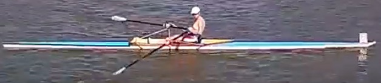
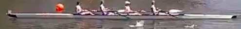
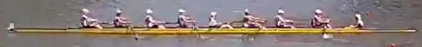
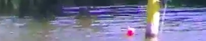
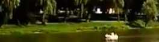
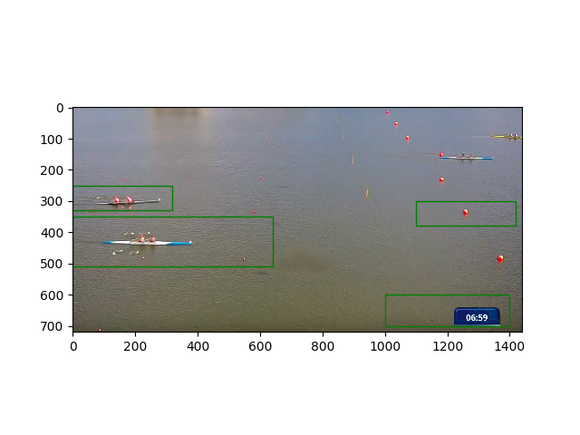
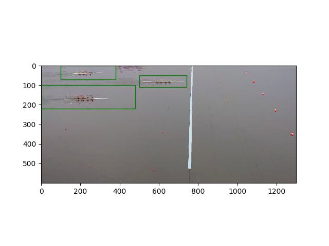
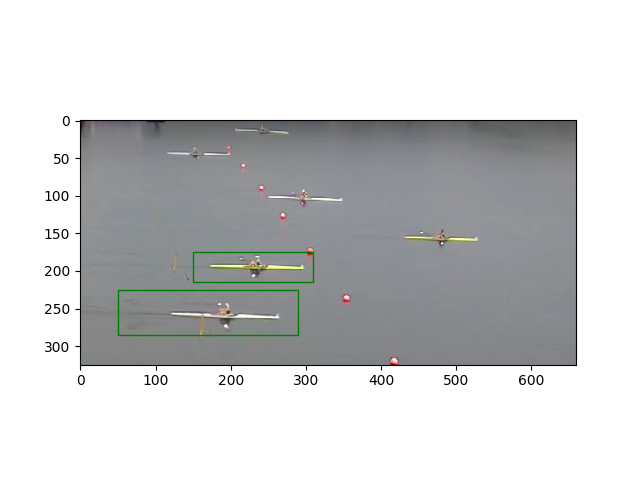
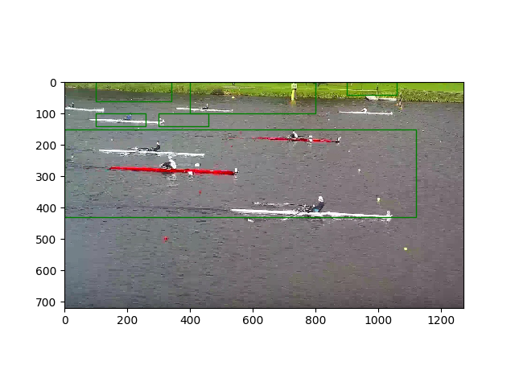
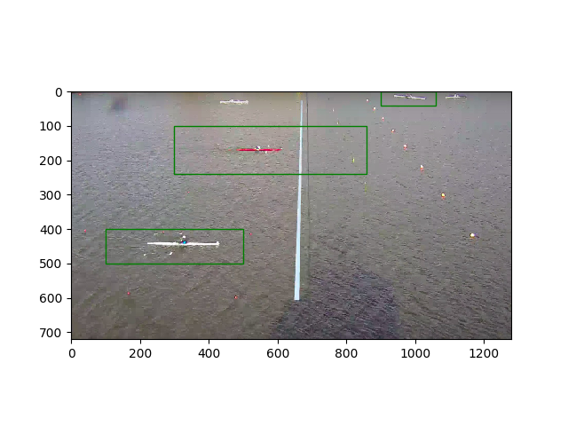

# Boat-detector
The goal was to make system that detects rowing boats in real time and to semi-automize cameras during [live streaming of rowing regattas](https://youtu.be/TYqMPD-ogRI).
 
# Algorithm
Algorithm scans through  image, for every  pixel it extracts  smaller fragments of an image with current pixel in center. Then every fragment is given to neural network for detection. Hence number of detections is equal to  Smaller  and bigger  result in better detection but increase run-time __drastically__.

For an `1280x720` image and `k = 50`, `n = 12` neural network has to perform approximately `221,184` detections and return ones with the highest probability rate.

This approach is not very efficient and results in long run-time (about 30s) for every image. Thus this algorithm cannot be used in real-time video analysis.

# Training
Neural network was trained using `~10,000` images taken from Youtube [live streams](https://youtu.be/FmIYS_HoOcU?t=12061) of rowing regattas.

~5,000 photos of boats: 
 
 
  
~5,000 photos of background: 
 
 
 
 
# Sample output
To run the algorithm one should place file with [trained weights](https://drive.google.com/open?id=1oSi8GdSwcwuVJtlZKOSVpd_2f8YIjzLX) in /models directory 
 
 
 
 
 
